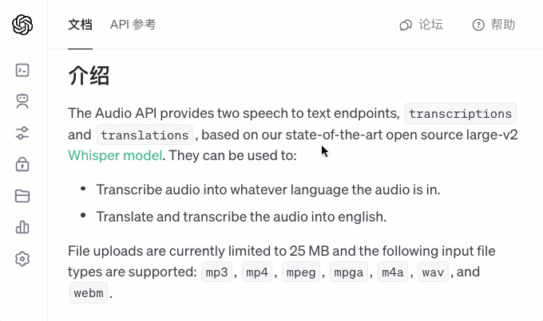
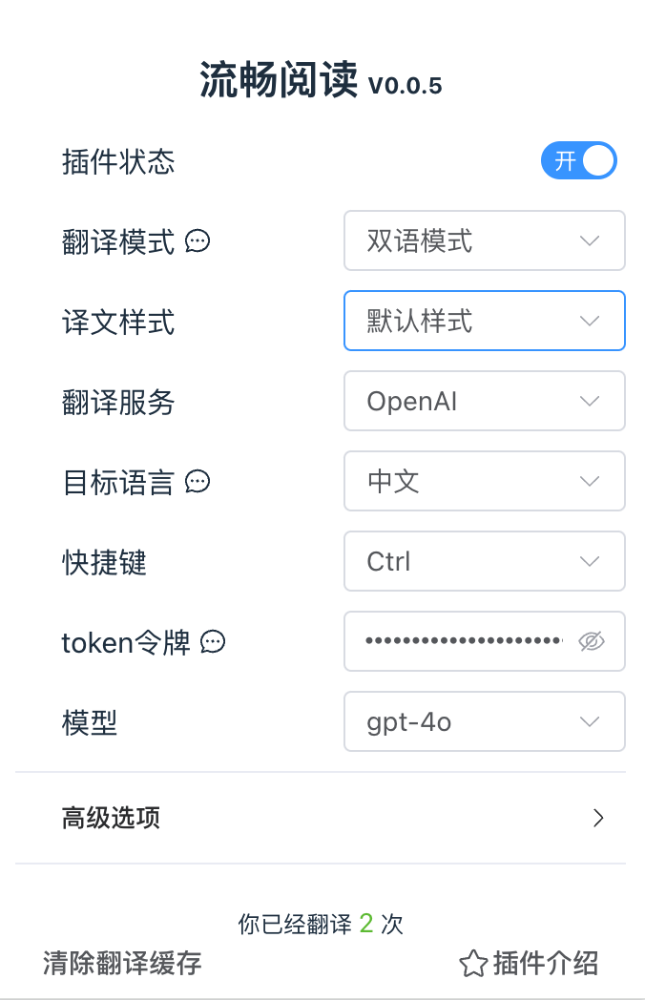
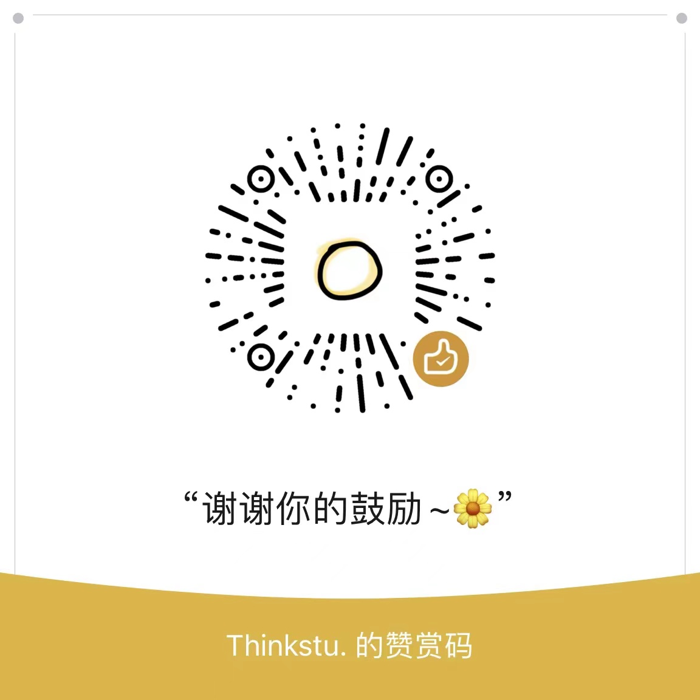

# 流畅阅读 

> Fluent Read，基于母语般的阅读体验，[B站视频介绍](https://www.bilibili.com/video/BV1ux4y1e73x)。

中文 | [English](https://github.com/Bistutu/FluentRead/blob/main/misc/README_EN.md)

流畅阅读是一款高效的浏览器翻译插件，可以将网页上的文字翻译成任何语言，方便、快捷、直观，支持人工智能引擎。

流畅阅读采用 TypeScript + [Vue3](https://cn.vuejs.org/) + [Element-Plus](https://element-plus.org/) + [WXT](https://wxt.dev/) 框架编写，支持编译成可安装在绝大多数浏览器的插件。

<kbd></kbd>

<kbd></kbd>

# 安装指南

> 插件已经上架各大浏览器的应用商店，可以点击下方链接进行安装：
>

- **Chrome 浏览器**：[直接安装](https://chromewebstore.google.com/detail/流畅阅读/djnlaiohfaaifbibleebjggkghlmcpcj?hl=zh-CN&authuser=0)、[备用链接](https://www.crxsoso.com/webstore/detail/djnlaiohfaaifbibleebjggkghlmcpcj)
- **Edge 浏览器**：[直接安装](https://microsoftedge.microsoft.com/addons/detail/%E6%B5%81%E7%95%85%E9%98%85%E8%AF%BB/kakgmllfpjldjhcnkghpplmlbnmcoflp?hl=zh-CN)、[备用链接](https://www.crxsoso.com/webstore/detail/djnlaiohfaaifbibleebjggkghlmcpcj)
- **Firefox（火狐）浏览器**：[直接安装](https://addons.mozilla.org/zh-CN/firefox/addon/%E6%B5%81%E7%95%85%E9%98%85%E8%AF%BB/?utm_source=addons.mozilla.org&utm_medium=referral&utm_content=search)、[备用链接](https://www.crxsoso.com/firefox/detail/流畅阅读)
- **其他浏览器，尝试**：[备用链接](https://www.crxsoso.com/webstore/detail/djnlaiohfaaifbibleebjggkghlmcpcj)

若直接安装失败，也可以下载插件的压缩包，然后打开浏览器的**管理扩展程序窗口**、激活开发者模式，并将压缩包**拖进浏览器**内进行安装。


> 手机版如何安装？

手机版目前只支持使用**油猴插件**进行安装，油猴脚本相对于正式版本有更新延迟，安装方式如下：

1. 在浏览器中安装 [油猴插件](https://www.tampermonkey.net)（如已安装则跳过）
2. 在油猴中安装 [流畅阅读](https://greasyfork.org/zh-CN/scripts/482986-%E6%B5%81%E7%95%85%E9%98%85%E8%AF%BB) 插件

# 特点介绍

1. 多种翻译方式：

   1. 快捷键翻译：将鼠标悬浮在文本上，并按下设定的快捷键即可翻译。
   2. 滑动翻译：持续按住快捷键，同时用鼠标滑动选择需要翻译的文本区域。

2. 支持缓存与回译：

   为了避免重复翻译句子、减少请求次数，流畅阅读基于每个页面做了翻译缓存，你无需关心具体细节（蓝色表示正常翻译、绿色表示使用缓存），当你使用缓存时，插件不会发生网络请求。

   <kbd></kbd>

   当你将鼠标悬浮在已翻译的文本上并按下快捷键时，会触发**回译功能**。
   
   <kbd></kbd>

# 常见问题解答

<details>
    <summary>1、我应该如何获取token？</summary>
  &emsp;&emsp;如果你想获取翻译服务的token，建议直接在百度或Google中以关键词 <code>模型名称 + api</code> 进行搜索。
</details>
<details>
    <summary>2、我的token会不会被别人窃取？</summary>
  &emsp;&emsp;不会。流畅阅读会将你输入的token全部保存在浏览器本地，没有任何第三方能够窃取你的token数据，包括我们自己。
</details>
<details>
  <summary>3、我的数据会被中间人获取吗？</summary>
  &emsp;&emsp;不会。流畅阅读不会收集你的数据，你的所有翻译请求都会被<strong>直接转发至翻译服务提供商</strong>，没有中间人可以获取你们之间的翻译记录。
</details>
<details>
    <summary>4、为什么翻译的内容不准确？</summary>
&emsp;&emsp;翻译可能不准确的原因有很多。首先，翻译引擎可能无法完全理解原文的上下文和细微的语言差异。其次，不同语言之间的语法结构和表达方式可能存在很大差异，这使得直接翻译时难以保留原文的全部含义，<strong>建议更换其他模型进行尝试</strong>。
</details>
<details>
    <summary>5、为什么要开源？</summary>
&emsp;&emsp;这是作者在大学期间的最后一份作品，也是一份毕设。
</details>
<details>
    <summary>6、这款软件如何盈利？</summary>
&emsp;&emsp;正如你所见，这款软件目前并没有任何盈利的地方，所有的收入均靠捐赠。
</details>


# 版本更新记录

- 2024-04-01：使用 Vue3 + WXT 重构程序，重新发布 0.01 版本
- 2024-03-04：1.30版本更新
  1. 增加 [DeepL](https://deepl.com/zh/) 翻译服务
  2. 增加 [ollama](https://github.com/ollama/ollama) 本地大模型支持
  3. 兼容移动设备，实现“三指触摸”翻译
  4. 优化缓存逻辑
- 2024-02-18：1.0版本发布。
  1. 接入微软机器翻译
  2. 接入 OpenAI、智谱清言、moonshot 等人工智能引擎
  3. 增加快捷键翻译功能
  4. 增加翻译缓存与回译功能
- 2024-01：0.6版本发布
- ...
- 2023-12：0.1版本发布

# 开源许可证

[GPL-3.0 license](https://github.com/Bistutu/FluentRead#)

# 如何运行程序？

```shell
git clone https://github.com/Bistutu/FluentRead.git
cd ./FluentRead
pnpm install && pnpm dev
```

```shell
# 打包为支持 Chromium 内核的插件
pnpm zip
# 打包为支持 FireFox 内核的插件
pnpm zip:firefox
```

# Star 历史记录

[](https://star-history.com/#Bistutu/FluentRead&Date)

# 赞赏码

如果您希望向作者给予鼓励，请使用「微信」扫描下面二维码，您的名字将会出现在赞助名单上。



| 序号 |       🌼赞助者🌼        | 赞助金额 |
| :--: |:--------------------:| :------: |
|  1   |         TOO          |   100    |
|  2   |        很酷的小当家        |    57    |
|  3   |       coonut🥥       |    36    |
|  4   |      hoochanlon      | 23.7 |
| 5 |        一懒众山小.        |    18    |
| 6 |          嘴馋          |    17    |
| 7 |      听说海能吞掉鱼的眼泪      |    17    |
| 8 | 吆吆好叼啊 | 10 |
| 9 |          汤晴          |   6.6    |
| 10 |       真心不过半斤ぴ        |    5     |
| 11 |          …           |    …     |


