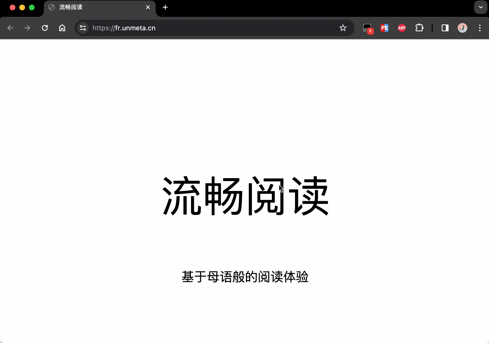

# 流畅阅读 

> Fluent Read，基于母语般的阅读体验

拥有基于上下文语境的人工智能翻译引擎，为网站提供更加友好的翻译，让所有人都能够拥有基于母语般的阅读体验。

<kbd></kbd>

# 安装指南

1. 在浏览器中安装 [油猴插件](https://www.tampermonkey.net)（如已安装则跳过）
2. 在油猴中安装 [流畅阅读](https://greasyfork.org/zh-CN/scripts/482986-%E6%B5%81%E7%95%85%E9%98%85%E8%AF%BB) 插件

# 如何使用？

1. 打开油猴插件，**配置**你想要的翻译服务（如果选择 AI 翻译则需要填写 `token`）。

   <kbd></kbd>

2. 翻译功能

   流畅阅读提供了 2 种翻译方式，分别为：

   - 将鼠标悬浮在想要翻译的文本上面，按下快捷键进行翻译。
   - 持续按住快捷键，鼠标滑动至文本进行翻译。

3. 缓存与回译功能

   为了避免 AI 模型重复翻译句子，流畅阅读基于每个页面做了缓存，你无需关心具体细节（蓝色表示正常翻译、绿色表示使用缓存）。

   <kbd></kbd>

   当你将鼠标悬浮在已翻译的文本上并按下快捷键时，会触发“回译”功能。

   <kbd></kdb>

4. 部分网站定制化翻译功能

   由于部分网站属于“较常”访问的站点，流畅阅读在编写时考虑到了这些场景，因此针对部分网站做了专门的翻译，这些站点包括但不限于：

   [OpenAI官网](https://openai.com/)、[Docker仓库](https://hub.docker.com)、[Maven仓库](https://mvnrepository.com/)、[Stackoverflow](https://stackoverflow.com/)、[GitHub Star 趋势生成网](https://star-history.com/)、[Coze人工智能助手](https://www.coze.com)

# 为什么是流畅阅读？

1. 程序开源、免费

2. 代码接受审查、不收集任何用户信息，保证数据安全

3. 支持常见国外或国产AI大模型，如：

   [chatGPT](https://platform.openai.com/)、[Gemini](https://gemini.google.com/)、[通义千问](https://dashscope.console.aliyun.com/overview)、[智谱清言](https://open.bigmodel.cn/)、[文心一言](https://cloud.baidu.com/wenxin.html)、[moonshot](https://www.moonshot.cn/)

4. 支持 chatGPT 自定义 API 接口地址，支持使用国内代理访问

# 常见问题解答

    
1、我该如何获取 token？

  &emsp;&emsp;如果你想获取各家大模型的 token，建议直接在百度或 Google 中以关键词 <code>模型名称 + api</code> 进行搜索。

    
2、为什么翻译的内容不准确？

&emsp;&emsp;翻译可能不准确的原因有很多。首先，翻译引擎可能无法完全理解原文的上下文和细微的语言差异。其次，不同语言之间的语法结构和表达方式可能存在很大差异，这使得直接翻译时难以保留原文的全部含义。<strong>建议更换其他模型进行尝试</strong>

  
3、我的数据会被中间人获取吗？

  &emsp;&emsp;流畅阅读代码完全开源，不会收集你的数据，你的所有翻译请求都会被<strong>直接转发</strong>至相应的官方接口。所以说，你的数据安全取决于你所使用的翻译服务提供商。</strong>

# 版本更新记录

- 2024-03-03：1.30版本更新
  - 增加 DeepL 翻译
  - 优化 AI 翻译模型
  - 优化缓存逻辑
- 2024-02-18：1.0版本发布。
  1. 接入微软机器翻译
  2. 接入 OpenAI、智谱清言、文心一言、通义千问、Gemini、moonshot 人工智能引擎
  3. 增加鼠标快捷键操作
  4. 增加翻译缓存与回译功能
- 2024-01：0.6版本发布，增加讯飞翻译引擎
- ...
- 2023-12：0.1版本发布

# 开源许可证

[GPL-3.0 license](https://github.com/Bistutu/FluentRead#)

# star 历史记录

# 最重要的事情！

**春招求职！**

姓名：Chen Miankang

院校：北京信息科技大学 计算机专业  2024 届本科毕业生

专业技能：熟悉 Go 以及 Java 生态

实习经历：米哈游（半年）

独立开发者作品：[流畅阅读](https://github.com/Bistutu/FluentRead)、[音乐迁移网站](https://github.com/Bistutu/gomusic)、[空闲教室查询应用](https://github.com/Bistutu/BistuEmpty)

**在线简历**：[点击查看](https://thinkstu-typora.oss-cn-hangzhou.aliyuncs.com/typora/%E9%99%88%E7%BB%B5%E5%BA%B7-%E7%AE%80%E5%8E%86.pdf)

**联系方式**：1914493943@qq.com

