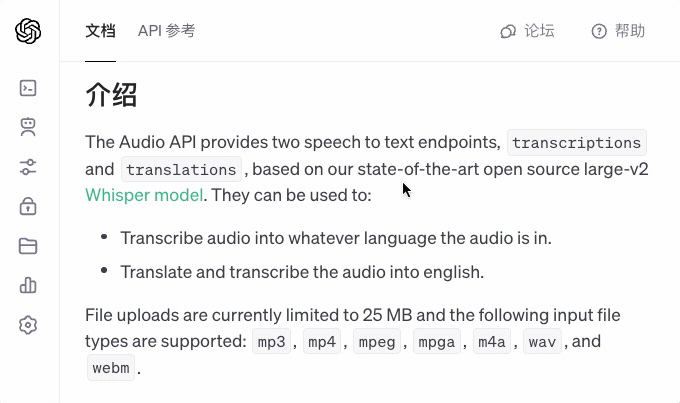
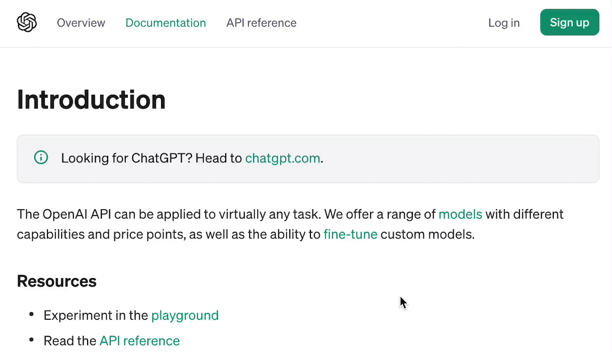
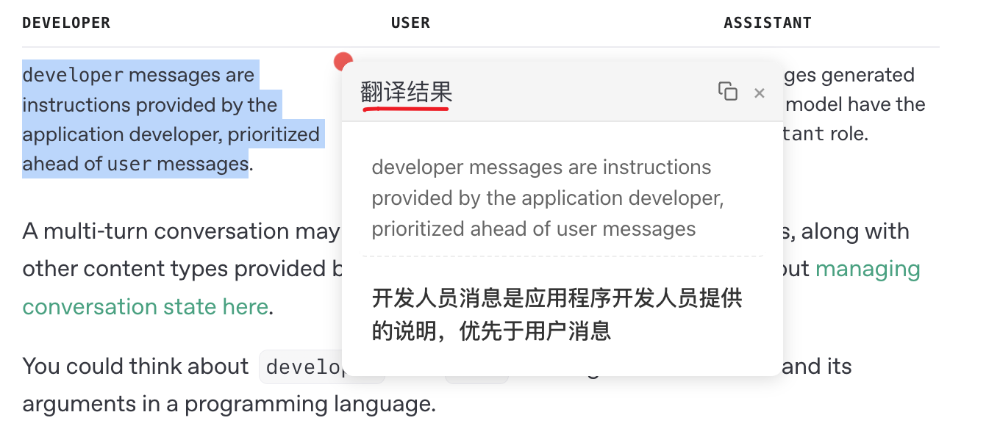

# 流畅阅读 (FluentRead)

> [English](https://github.com/Bistutu/FluentRead/blob/main/misc/README_EN.md) | 中文

Open Immersive Translate 开源的沉浸式翻译。

一款革命性的浏览器开源翻译插件，让所有人都能够拥有母语般的阅读体验。

1. [官方文档（必看）](https://fluent.thinkstu.com/)
2. [B站视频介绍](https://www.bilibili.com/video/BV1ux4y1e73x/)
3. [deepwiki 架构介绍](https://deepwiki.com/Bistutu/FluentRead)

## 🌟 特性

- **智能翻译**：支持 20+ 种翻译引擎，包括传统翻译和 AI 大模型。如：微软翻译、谷歌翻译、DeepL翻译、OpenAI、DeepSeek、Kimi、Ollama、自定义引擎等。
- **双语对照**：支持原文与译文并列显示，让阅读更轻松。
- **划词翻译**：选中任意文本，即可获得即时翻译结果，一键复制译文，提高阅读效率。
- **全文翻译**：通过悬浮球一键翻译整个网页，无需刷新页面即可切换。
- **隐私保护**：所有数据本地存储，代码开源透明。
- **高度定制**：丰富的自定义选项，满足不同场景需求。
- **完全免费**：开源免费，非商业化项目。

<kbd></kbd>

<kbd></kbd>

<kbd></kbd>

## 📦 安装

| 浏览器 | 安装方式 |
|-------|---------|
| Chrome | [Chrome 应用商店](https://chromewebstore.google.com/detail/%E6%B5%81%E7%95%85%E9%98%85%E8%AF%BB/djnlaiohfaaifbibleebjggkghlmcpcj?hl=zh-CN&authuser=0) \| [国内镜像](https://www.crxsoso.com/webstore/detail/djnlaiohfaaifbibleebjggkghlmcpcj) |
| Edge | [Edge 应用商店](https://microsoftedge.microsoft.com/addons/detail/%E6%B5%81%E7%95%85%E9%98%85%E8%AF%BB/kakgmllfpjldjhcnkghpplmlbnmcoflp?hl=zh-CN) |
| Firefox | [Firefox 附加组件商店](https://addons.mozilla.org/zh-CN/firefox/addon/%E6%B5%81%E7%95%85%E9%98%85%E8%AF%BB/) |

## 📖 使用文档

请直接访问 [流畅阅读官方文档](https://fluent.thinkstu.com/) 获取详细的：
- 功能介绍
- 配置指南
- 使用教程
- 常见问题

# Star 历史记录

