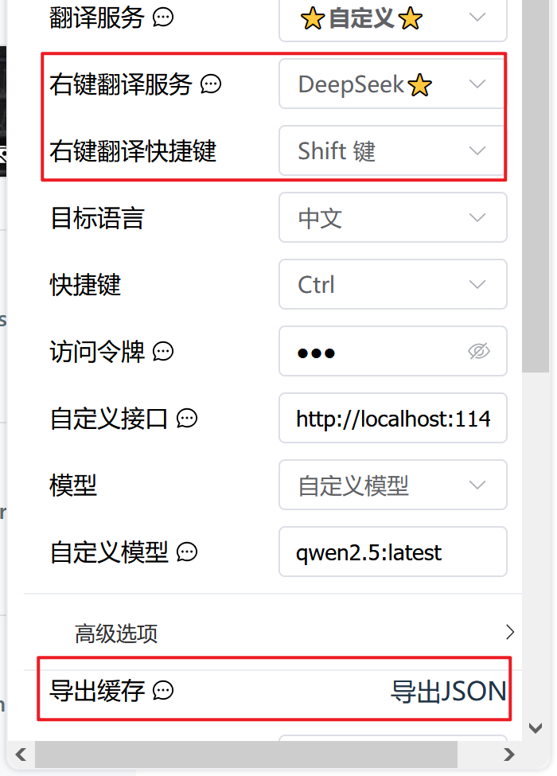

# 本项目是给人定制的流畅阅读 (FluentRead)插件

为了在本地llm翻译不准确时，使用deepseek翻译，并缓存deepseek翻译的内容，微调本地模型

## 🌟 个人添加功能

- 支持保存deepseek翻译内容缓存
- 支持导出缓存内容



- 添加右键菜单翻译和右键菜单翻译快捷（先在翻译服务配置deepseek，然后右键服务直接选deepseek）


- 添加修改译文功能


- 导出的内容如下

 ```json
[
  {
    "instruction": "Translate the following text into zh-Hans, If translation is unnecessary (e.g. proper nouns, codes, etc.), return the original text. NO explanations. NO notes:\n\n\n    Same here.. I was pretty excited the moment it was announced, and frankly speaking, the demo on their chat.qwen.ai looks pretty viable. I would definitely use if we can run it locally as easy as the other local models.\n  ",
    "input": "",
    "output": "我也是...宣布的那一刻我相当兴奋，坦白说，他们在chat.qwen.ai上的演示看起来相当可行。如果能像其他本地模型一样轻松地在本地运行，我肯定会用。",
    "system": "You are a professional, authentic machine translation engine."
  }
]

 ```


# 流畅阅读 (FluentRead)

> 官方文档：https://fluent.thinkstu.com/

[English](https://github.com/Bistutu/FluentRead/blob/main/misc/README_EN.md) | 中文

一款革新性的浏览器开源翻译插件，让所有人都能够拥有母语般的阅读体验。[B站视频介绍](https://www.bilibili.com/video/BV1ux4y1e73x/)


## 🌟 特性

- **智能翻译**：支持 20+ 种翻译引擎，包括传统翻译和 AI 大模型。如：微软翻译、谷歌翻译、DeepL翻译、OpenAI、DeepSeek、Kimi、SiliconCloud、Ollama、自定义引擎等。
- **双语对照**：支持原文与译文并列显示，让阅读更轻松
- **隐私保护**：所有数据本地存储，代码开源透明
- **高度定制**：丰富的自定义选项，满足不同场景需求
- **完全免费**：开源免费，非商业化项目

<kbd></kbd>

<kbd></kbd>

## 📦 安装

| 浏览器 | 安装方式 |
|-------|---------|
| Chrome | [Chrome 应用商店](https://chromewebstore.google.com/detail/%E6%B5%81%E7%95%85%E9%98%85%E8%AF%BB/djnlaiohfaaifbibleebjggkghlmcpcj?hl=zh-CN&authuser=0) \| [国内镜像](https://www.crxsoso.com/webstore/detail/djnlaiohfaaifbibleebjggkghlmcpcj) |
| Edge | [Edge 应用商店](https://microsoftedge.microsoft.com/addons/detail/%E6%B5%81%E7%95%85%E9%98%85%E8%AF%BB/kakgmllfpjldjhcnkghpplmlbnmcoflp?hl=zh-CN) |
| Firefox | [Firefox 附加组件商店](https://addons.mozilla.org/zh-CN/firefox/addon/%E6%B5%81%E7%95%85%E9%98%85%E8%AF%BB/) |

## 📖 使用文档

请直接访问 [流畅阅读官方文档](https://fluent.thinkstu.com/) 获取详细的：
- 功能介绍
- 配置指南
- 使用教程
- 常见问题

# Star 历史记录

[](https://star-history.com/#Bistutu/FluentRead&Date)

