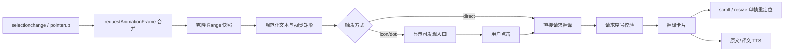
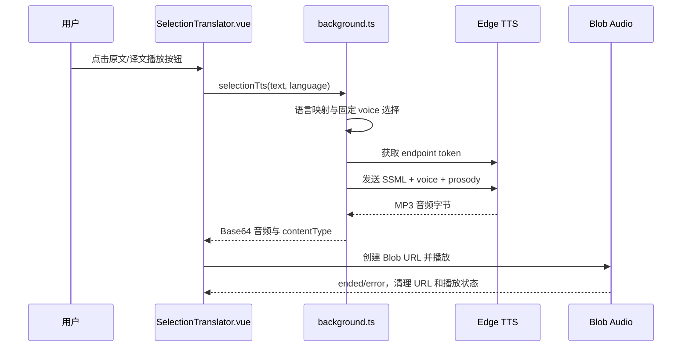

# FluentRead 划词翻译核心机制改造报告

日期：2026-08-16  
项目：FluentRead  
工作树：`FluentRead-selection-translation-core-20260816`  
分支：`codex/selection-translation-core-20260816`  
提交：`cc34f95 feat: rebuild selection translation core`

## 结论摘要

本次改造聚焦“划词翻译”，没有实现圈选翻译。核心目标是减少划词过程中的主线程工作、修正多行文本和视口边缘的定位、让语音入口可发现，并增加可配置的触发方式。

已经完成并验证的部分：

- 用 `requestAnimationFrame` 合并高频选择事件，避免每次 `selectionchange` 都触发定位和状态更新。
- 选择结束后保存独立的 `Range` 快照和视觉边缘矩形，不再长期依赖会失效的原始 `Range`。
- 指示图标和翻译卡片采用独立的视口定位与边界夹紧，支持上下翻转。
- 使用请求序号丢弃过期翻译结果，避免快速连续划词时旧结果覆盖新结果。
- 默认显示可发现的操作图标；同时支持直接翻译、图标触发、圆点触发三种模式。
- 原文和译文的播放按钮始终可见，不再依赖鼠标悬浮才能发现。
- 语音优先使用后台 Edge TTS 固定 voice，按源语言/目标语言选择声音；Edge TTS 不可用时才回退浏览器 `SpeechSynthesis` 和 Google Translate TTS URL。
- 增加核心几何计算、文本规范化、语言规范化和配置兼容性测试。

尚未完全闭环的部分：

- 目前已接入 Edge TTS 的固定高质量 voice 和短文本分段；还没有实现阅读蛙式完整的音色目录、可视化 voice 设置和 offscreen 播放管线。
- 真实长页面滚动过程的自动化证据受隔离浏览器无法访问临时 localhost 服务影响，代码已实现 scroll/resize 重定位，但该场景仍需在可访问测试页面中复测。
- 本次浏览器验证使用本地确定性缓存避免依赖外部翻译服务；Edge TTS endpoint 已真实返回英文/中文音频并触发播放状态，但隔离窗口不作为人工听感验收环境。

## 1. 原实现的问题梳理

### 1.1 划词过程存在不必要的高频工作

旧实现同时监听 `mouseup`、`selectionchange` 等事件，并配合定时器处理。浮层显示后又使用 Floating UI 的 `autoUpdate(..., { animationFrame: true })` 持续更新位置。这样会造成：

- 用户拖动选择时，事件回调、文本读取、DOM 更新和定位计算相互叠加。
- 浮层存在期间，即使页面没有发生影响定位的变化，也会按动画帧持续计算。
- 定时器和事件处理存在竞态，快速改变选择时可能显示旧文本或旧状态。

这类问题会直接表现为划词卡顿、页面滚动时额外耗电，以及复杂页面上的响应延迟。

### 1.2 原点位置依赖不稳定的 Range/容器几何

旧实现把活动 `Range` 作为浮动定位参考，并通过包装容器的尺寸参与定位。多行文本、选择方向反向、页面滚动、视口边缘和字体重排时，`Range` 的生命周期和包装容器几何并不稳定，容易出现：

- 原点偏离用户实际选中的文本边缘。
- 多行选择时取到整段包围盒，而不是用户预期的起始/结束视觉边缘。
- 卡片在视口顶部或底部被裁切。
- 页面变化后旧定位引用仍然存在，但已经不再代表当前选择。

### 1.3 TTS 语言与播放实现不够可靠

旧实现主要依赖文本启发式检测语言，再拼接 Google TTS URL；原文和译文没有稳定地使用配置中的源语言/目标语言。对于短文本、混合语言、中文变体和翻译结果，启发式判断可能选择错误的语言参数。

此外，原实现同时维护 HTMLAudioElement 和浏览器语音合成两条路径，停止、错误和播放状态容易不同步；播放按钮又通过 hover CSS 显示，用户很难发现该功能。

### 1.4 交互状态容易被快速操作打乱

旧实现没有明确的“当前选择请求序号”。用户连续选择时，先发出的翻译请求可能晚于后发请求返回，导致旧结果覆盖新选择。悬浮隐藏计时器也可能与点击、选择清理互相竞争。

### 1.5 设置项不足以表达实际交互

旧设置主要控制是否启用和显示模式，没有把“用户如何发现/触发划词翻译”作为独立设置项。对于希望低干扰或希望明显入口的用户，缺少可调节空间。

## 2. 本次实现的修改

### 2.1 新的划词状态与事件管线

核心文件：`components/SelectionTranslator.vue`、`entrypoints/utils/edgeTts.ts`、`entrypoints/background.ts`

新的处理流程如下：

具体变化：

- 使用 `requestAnimationFrame` 合并 `selectionchange` 和 `pointerup`，把一次拖选期间的多次事件压缩为一次处理。
- 将选区复制为独立快照，并在快照上做文本清理、长度限制和方向判断。
- 通过 `getClientRects()` 获取多行选择的视觉矩形，`chooseSelectionRect()` 根据选择方向选择更符合用户预期的边缘。
- 定位只在显示、选择变化、scroll 或 resize 时调度一帧；不再让浮层在整个生命周期内以动画帧持续更新。
- 维护递增的请求序号。新选择产生后，旧翻译响应即使返回，也不会覆盖当前选择。
- 对扩展 Shadow UI 内的 pointer 事件做隔离，并在图标、卡片按钮上阻止默认行为和事件冒泡，避免点击操作时丢失文本选择。
- 关闭、Escape、点击外部区域、组件卸载时统一清理监听器、请求状态和音频播放。

### 2.2 定位修正

核心函数位于 `entrypoints/utils/selectionTranslatorCore.ts`：

- `chooseSelectionRect()`：从多行选区矩形中选择视觉起点/终点所在行。
- `calculateSelectionPopupPosition()`：以视口坐标计算入口或卡片位置。
- 位置会进行左右边界夹紧；上方空间不足时翻转到下方，仍不足时继续限制在视口内。
- 指示入口和翻译卡片分别计算位置，避免“入口位置正确但卡片位置偏移”的耦合问题。

这套方式不依赖固定的 350px 包装容器位置，也不把一个长期存活的 `Range` 当作浮动定位锚点。

### 2.3 TTS 播放改造

核心文件：`components/SelectionTranslator.vue`、`entrypoints/utils/selectionTranslatorCore.ts`

- 原文播放使用配置中的 `config.from`；配置为 `auto` 时才使用 `detectlang` 结果。
- 译文播放使用配置中的 `config.to`，不再重新根据译文短文本猜语言。
- `normalizeSpeechLanguage()` 将 `zh-Hans`、`zh-Hant`、`en` 等配置统一映射到更适合浏览器语音接口的 BCP 47 语言标签，例如 `zh-CN`、`zh-TW`、`en-US`。
- 优先通过扩展后台调用 Edge TTS，英文默认使用 `en-US-AvaMultilingualNeural`，简体中文使用 `zh-CN-XiaoxiaoMultilingualNeural`；不再受本机第一个系统 voice 影响。
- Edge TTS 使用 SSML 显式设置 locale、voice、rate、pitch、volume，并对文本做 XML 转义；超过单次字节限制时按语义边界分段。
- 页面侧接收后台返回的音频字节并生成 Blob URL 播放；新的请求会停止旧播放，关闭页面或选区时释放音频 URL。
- Edge TTS 网络请求失败时，才回退到浏览器 `SpeechSynthesis`；系统 voice 选择也增加了英文/中文的偏好排序，避免盲取第一个低沉 voice。
- 最后才回退到 Google `translate_tts`，并显式携带规范化语言参数。
- 原文和译文各有一个常驻播放按钮，按钮具有 `aria-label` 和 `title`，不需要悬浮才能发现。

与参考项目的取舍：阅读蛙使用 Edge TTS 的明确音色选择、音频分段和后台/offscreen 播放；简约翻译类方案强调浏览器内置语音接口和语言标签规范化。FluentRead 本次独立实现了 Edge TTS 的最小稳定链路，保留浏览器语音作为免费回退；后续再增加完整 voice 目录和 offscreen 播放即可，不直接复制参考项目代码。

### 2.4 设置与 UI 修改

新增配置：`selectionTranslatorTrigger`

可选值：

| 值 | 行为 |
|---|---|
| `direct` | 选择完成后直接发起翻译 |
| `icon` | 默认值，显示可发现的操作图标，点击后翻译 |
| `dot` | 显示紧凑圆点入口，点击后翻译 |

同时保留：

- `disabled`：关闭划词翻译。
- `bilingual`：显示原文和译文。
- `translation-only`：仅显示译文。

弹窗和设置页都增加了触发方式选择与提示文案，明确说明图标/圆点不依赖 hover 才能发现。相关文档同步更新到 `docs/guide/features.md`。

### 2.5 测试补充

新增 `tests/selectionTranslatorCore.test.ts`，覆盖：

- 多行矩形选择与正反向选择。
- 上方空间不足时的位置翻转。
- 视口边界夹紧。
- 选择文本空白规范化。
- 语音语言标签规范化。

`tests/model.test.ts` 增加了旧配置兼容和触发方式/显示模式归一化测试。

## 3. 文件变更清单

| 文件 | 修改内容 |
|---|---|
| `components/SelectionTranslator.vue` | 重写划词状态机、定位、入口、卡片、TTS 和清理逻辑 |
| `entrypoints/utils/selectionTranslatorCore.ts` | 新增可单测的选区几何、文本和语言纯函数 |
| `entrypoints/utils/edgeTts.ts` | 新增 Edge TTS voice 映射、签名、token、SSML、分段和音频合并 |
| `entrypoints/background.ts` | 增加后台 Edge TTS 音频请求消息处理 |
| `wxt.config.ts` | 增加 Edge TTS endpoint 的 host permissions |
| `entrypoints/utils/model.ts` | 新增并归一化 `selectionTranslatorTrigger` |
| `entrypoints/popup/App.vue` | 增加启用、显示模式和触发方式设置 |
| `entrypoints/popup/style.css` | 增加设置提示样式 |
| `components/Main.vue` | 增加设置页配置项及新的交互说明 |
| `docs/guide/features.md` | 更新划词翻译使用说明 |
| `tests/model.test.ts` | 增加配置兼容性测试 |
| `tests/selectionTranslatorCore.test.ts` | 新增核心计算测试 |
| `docs/reports/selection-translation-core-report-2026-08-16.md` | 本报告 |

## 4. 验证结果

### 4.1 自动化验证

以下验证已通过：

| 验证项 | 结果 |
|---|---|
| `pnpm compile` | 通过 |
| `pnpm test -- --run` | 通过，9 个测试文件、113 个测试 |
| `pnpm build` | 通过，WXT 0.20.18 Chrome MV3 构建成功 |
| `git diff --check` | 通过 |

### 4.2 隔离浏览器验证

在隔离 Edge 实例中完成了自定义划词流程：

- 设置页能够切换 `direct`、`icon`、`dot` 三种触发方式。
- 真实鼠标拖选能够捕获文本。
- 默认图标在没有 hover 的情况下可见。
- 点击图标后翻译卡片正常打开。
- 卡片位于 1280×900 视口内，没有越界。
- 原文和译文两个播放按钮都直接可见。
- 英文 Edge TTS 真实返回 voice `en-US-AvaMultilingualNeural` 的音频数据。
- 中文 Edge TTS 真实返回 voice `zh-CN-XiaoxiaoMultilingualNeural` 的音频数据。
- 点击原文播放按钮后显示“正在播放原文”，播放图标切换为暂停状态。

截图证据：

- `/private/tmp/fluentread-selection-browser-evidence/popup-selection-settings.png`
- `/private/tmp/fluentread-selection-browser-evidence/selection-icon-visible.png`
- `/private/tmp/fluentread-selection-browser-evidence/selection-tooltip-visible.png`

该流程使用本地确定性缓存作为翻译响应，以隔离外部翻译服务波动；因此它验证的是选择、定位、交互和渲染链路，不代表真实 provider 网络质量或音频服务质量。

### 4.3 未通过或待补证据

- FluentRead 既有完整 UI 测试在悬浮球场景失败：`悬浮球关闭状态未更新`，失败位置在既有测试脚本的 floating drawer 断言。本次改动的自定义划词流程已通过，但不能据此宣称完整 UI 套件全绿。
- 长页面 scroll/resize 的真实浏览器证据尚未完成；隔离浏览器无法访问临时 localhost 测试服务。实现层已经加入单帧重定位和视口夹紧，仍需要在可访问的长页面中复测。
- 自动化确认了 Edge TTS 音频响应和播放状态，但隔离浏览器位于屏幕外，无法替代人工听感；英文是否仍显得低沉，最终仍需用户在本机扬声器环境中验收。

## 5. 当前交付状态

代码已提交在独立 worktree 的 `cc34f95`、`c3f64c7`、`153923f`。尚未创建远程 PR，也没有执行合并。原因是推送到 GitHub 需要外部写权限，且后续网络检查出现 `Could not resolve host: github.com`；因此当前状态是“本地实现和验证完成，远程 PR 阶段被环境阻塞”。

后续若允许外部 Git 写操作，顺序应为：推送当前分支、创建 PR、等待审阅批准，再执行真实 GitHub merge commit。当前不应把本地提交视为已经合并到主分支。

## 6. 后续建议

1. 先在真实长文章和多栏页面复测 scroll、resize、反向选择、视口顶部/底部和页面 DOM 变化。
2. 增加 Edge TTS voice 目录和设置项；视浏览器兼容性再把页面 Blob 播放迁移到 offscreen 音频管线。
3. 将翻译请求也抽成可取消的任务接口，在 provider 层支持 AbortSignal，进一步降低连续划词时的无效网络工作。
4. 修复或隔离既有 floating drawer UI 测试失败后，再进行完整扩展 UI 回归。
5. 在 PR 审阅前重点检查 Shadow DOM、输入框/可编辑区域、PDF/iframe、`notranslate` 页面和选择清理行为；本次范围仍不包括圈选翻译。

## 7. 本轮 UI 细化

根据视觉反馈，本轮在不改变划词逻辑和配置语义的前提下进一步收紧了界面：

- 默认划词入口从 28×28px 调整为 22×22px，hover 放大幅度和阴影也同步降低；紧凑圆点从 14px 调整为 10px。
- 翻译卡片宽度从 380px 调整为 344px，标题栏、操作按钮、内容区和文本块的内边距/间距整体收紧。
- 译文块增加细窄品牌色内侧强调线，保留原文/译文区分，但减少大面积粉色带来的视觉重量。
- 原文、译文播放按钮由 emoji 扬声器改为统一的 SVG 线性图标，并保持常驻可见；播放中使用暂停图标。
- 卡片标题改为更紧凑的“翻译结果 + via FluentRead”层级，复制和关闭按钮尺寸统一为 26px。

本轮隔离 Edge 实测结果：入口 `22×22px`，翻译卡片 `344px` 宽、约 `216px` 高，两个语音按钮均为 `26×26px` 且可见；截图保存在：

- `/private/tmp/fluentread-selection-ui-evidence-indicator.png`
- `/private/tmp/fluentread-selection-ui-evidence-tooltip.png`

## 8. 当前实际运行链路

### 当前 voice 规则

| 语言 | 当前 voice |
|---|---|
| 英语 `en` / `en-US` | `en-US-AvaMultilingualNeural` |
| 简体中文 `zh-Hans` / `zh-CN` | `zh-CN-XiaoxiaoMultilingualNeural` |
| 繁体中文 `zh-Hant` / `zh-TW` | `zh-TW-YunJheMultilingualNeural` |
| 日语 | `ja-JP-MasaruMultilingualNeural` |
| 韩语 | `ko-KR-HyunsuMultilingualNeural` |

当前不是直接把音频 URL 交给网页播放，而是由后台请求并转成 Blob 数据；这样可以避开网页 CSP 和跨域限制。Edge TTS 请求失败时，才进入浏览器原生语音和 Google TTS 回退路径。
