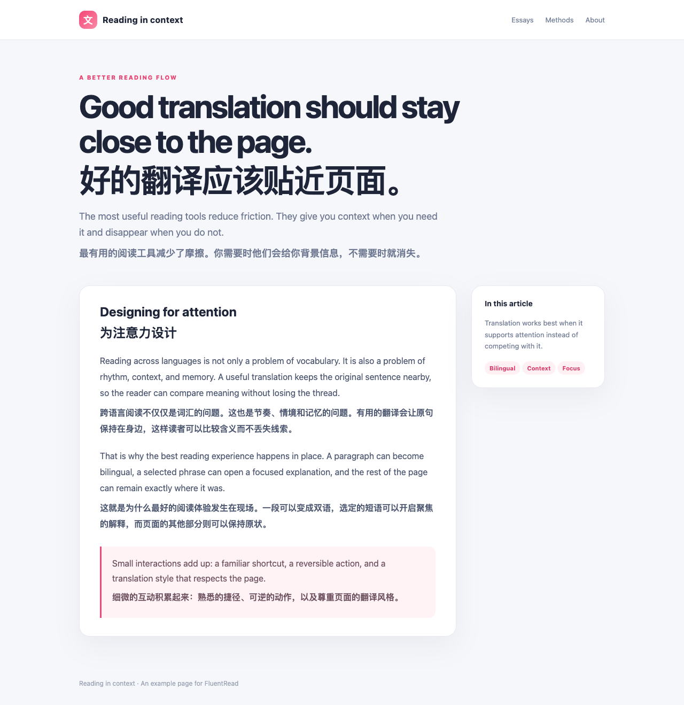
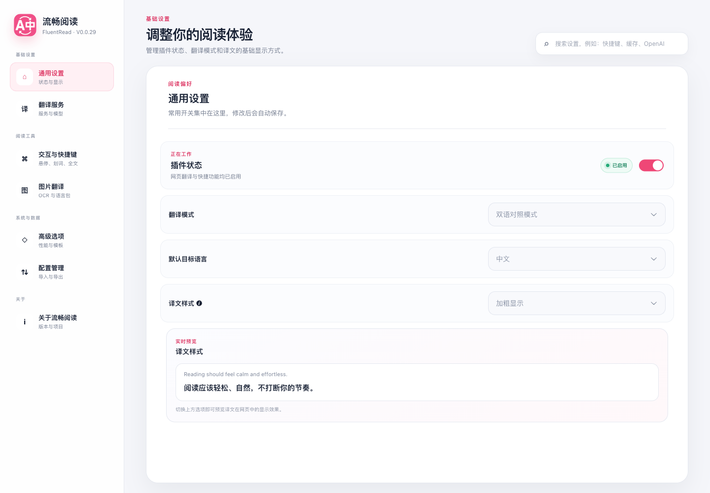

<div align="center">


# 流畅阅读（FluentRead）

### 让每个网页都自然地读起来。

一款开源浏览器翻译插件，提供网页双语阅读、即时划词翻译和灵活的翻译服务配置。

[](https://github.com/Bistutu/FluentRead/releases)
[](../LICENSE)
[](https://github.com/Bistutu/FluentRead)

<br />

**[安装](#安装)** · **[功能](#你可以用它做什么)** · **[官方文档](https://fluent.thinkstu.com/)** · **[English](../README.md)**

</div>

<p align="center">
  
</p>

流畅阅读把翻译放回阅读流程：可以保留原文与译文对照，只翻译当前需要的句子，也可以不离开当前页面完成全文翻译。你可以选择传统翻译服务、AI 服务或内置的免费回退服务，并按照自己的阅读习惯调整样式与快捷键。

## 你可以用它做什么

| 读得自然 | 控制得细致 |
| --- | --- |
| **网页双语阅读**：原文与译文同时保留，适合学习、研究和技术阅读。 | **多种翻译服务**：支持微软、谷歌、DeepL、DeepLX、Chrome 内置翻译，以及 OpenAI、DeepSeek、Gemini、Claude、Kimi、Ollama 兼容接口等 AI 服务。 |
| **全文翻译**：通过悬浮球、右键菜单或自定义快捷键翻译和恢复网页，无需刷新。 | **自定义模型与接口**：在设置页配置兼容 API、模型、提示词、请求体、代理和密钥。 |
| **划词翻译**：选中文本后打开聚焦的翻译卡片，支持复制和朗读。 | **本地优先**：偏好设置和翻译缓存保存在浏览器本地，API 密钥由插件在本地使用。 |
| **悬浮与手势触发**：支持鼠标悬停、双击、长按、中键和触屏手势。 | **阅读体验可调**：可以调整译文样式、主题、动画、缓存、并发，以及全文和划词翻译的独立快捷键。 |

### 还包括

- **免费翻译服务**：内置微软 → DeepLX → 谷歌的回退链；仅在服务报错或返回空结果时进入下一项。
- **图片翻译（Beta）**：使用本地 OCR 识别图片文字，按需下载语言包，并用可恢复的覆盖层显示译文。
- **翻译缓存**：按服务、模型、语言对和请求配置复用近期结果。
- **跨浏览器支持**：基于 WXT 和 Manifest V3 构建 Chromium 浏览器与 Firefox 版本。

## 截图

### 小巧的日常控制面板

弹窗集中放置常用操作：启用或暂停插件、选择语言和默认服务、打开完整设置，以及清理本地翻译缓存。

<p align="center">
  
</p>

### 能随阅读习惯扩展的设置页

设置页按通用设置、翻译服务与模型、交互与快捷键、图片翻译、高级选项和配置管理分区，保持界面清晰。

<p align="center">
  
</p>

<p align="center">
  
</p>

## 安装

| 浏览器 | 商店 |
| --- | --- |
| Chrome | [Chrome 应用商店](https://chromewebstore.google.com/detail/%E6%B5%81%E7%95%85%E9%98%85%E8%AF%BB/djnlaiohfaaifbibleebjggkghlmcpcj?hl=zh-CN) · [CrxSoso 国内镜像](https://www.crxsoso.com/webstore/detail/djnlaiohfaaifbibleebjggkghlmcpcj) |
| Edge | [Microsoft Edge 加载项](https://microsoftedge.microsoft.com/addons/detail/%E6%B5%81%E7%95%85%E9%98%85%E8%AF%BB/kakgmllfpjldjhcnkghpplmlbnmcoflp?hl=zh-CN) |
| Firefox | [Firefox 附加组件](https://addons.mozilla.org/zh-CN/firefox/addon/%E6%B5%81%E7%95%85%E9%98%85%E8%AF%BB/) |

如果需要本地构建，请使用 pnpm 安装依赖，然后把生成的 `./.output/chrome-mv3` 目录作为“已解压的扩展程序”加载。详细配置请查看[官方文档](https://fluent.thinkstu.com/)。

## 文档与社区

- [官方文档](https://fluent.thinkstu.com/)：功能、安装、翻译服务、快捷键和常见问题。
- [GitHub Issues](https://github.com/Bistutu/FluentRead/issues)：反馈问题或提出建议。
- [B站视频介绍](https://www.bilibili.com/video/BV1ux4y1e73x/)
- [DeepWiki 架构介绍](https://deepwiki.com/Bistutu/FluentRead)

## 开发

```bash
pnpm install
pnpm dev
pnpm test
pnpm compile
pnpm build
```

流畅阅读使用 Vue 3、TypeScript、Element Plus、WXT 和 Manifest V3，项目遵循 [GPL-3.0](../LICENSE) 开源许可证。

## Star 历史

[](https://star-history.dera.page/#Bistutu/FluentRead&Date)
